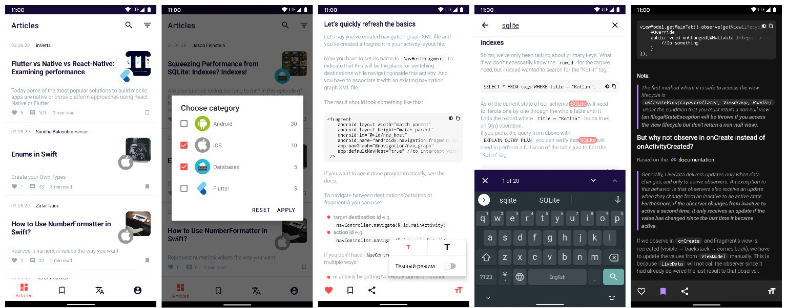

# Skill Articles

[app-debug.apk](app/build/outputs/apk/debug/app-debug.apk)
#### Приложение с отображением статей, написанное в ходе курса SkillBranch Middle Android Developer
### Скриншоты

## Инструменты разработки
- MVVM, LiveData, Coroutines
- Retrofit, OkHttp Interceptors, Moshi, OAuth
- Android Paging 2, Room database
- Custom view, Custom spans
- ContentProvider, editing photos
- Navigation Component
- Dagger 2